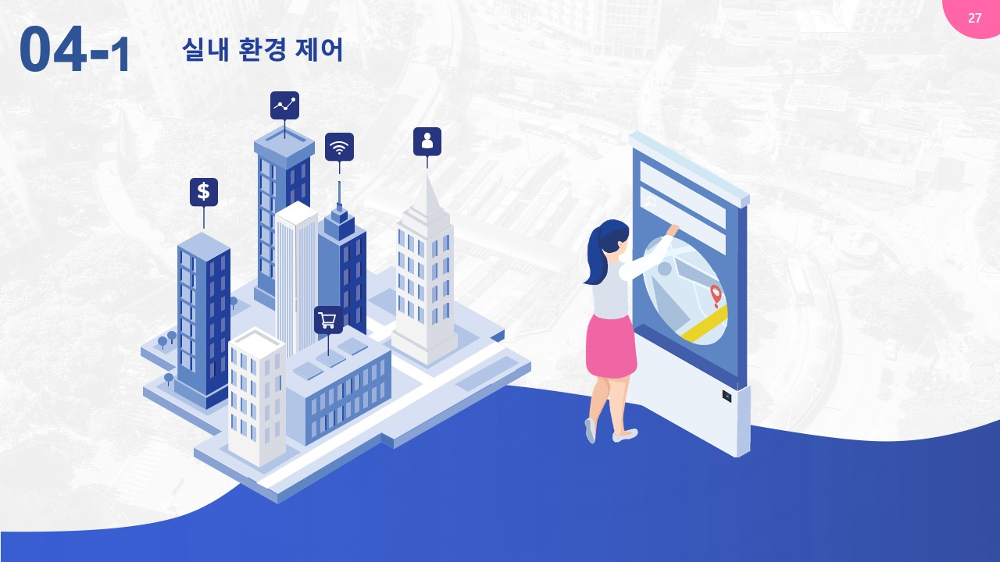
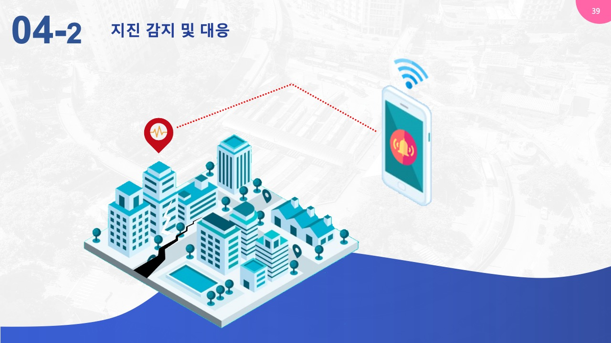
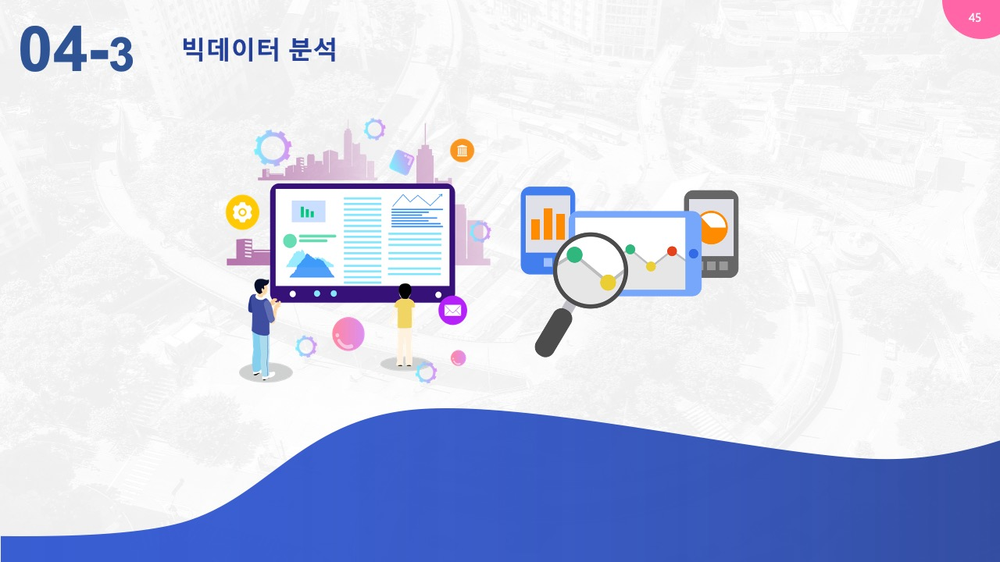

# IoT 센서를 활용한 건물 통합관제

## 시연 영상

유튜브 : https://youtu.be/6rksfFvd9_4 

## 목차

1.  개요
   1. 기획
   2. 시스템 구성도
   3. HW 구성도
   4. 활용 기술 (기술 스택)
   5. 활용 시나리오
2. 구현 결과
   1. IoT 센서
   2. 웹 대시보드
   3. 메인 서버
   4. 안드로이드 (웹/태블릿)
   5. 데이터 분석

## 1. 개요

### 1. 기획

- 데이터 수집
  * IoT 센서를 활용한 환경데이터 수집
- 데이터 활용
  * 시설제어 : 건물 내 쾌적한 환경 유지
  * 재난 : 지진 감지 및 대응
  * 빅데이터 : 에너지 리포트 제공
  * 보안 : 출입기록 및 통제구역 관리

### 2. 시스템  구성도

<이미지>

### 3. H/W 구성도

<이미지>

### 4. 활용 기술

<이미지>

### 5. 활용 시나리오

<이미지>

## 2. 구현 결과

### 1. IoT 센서

### 2. 웹 대시보드

### 3. 메인 서버

### 4. 안드로이드 (앱/태블릿)

### 5. 데이터 분석